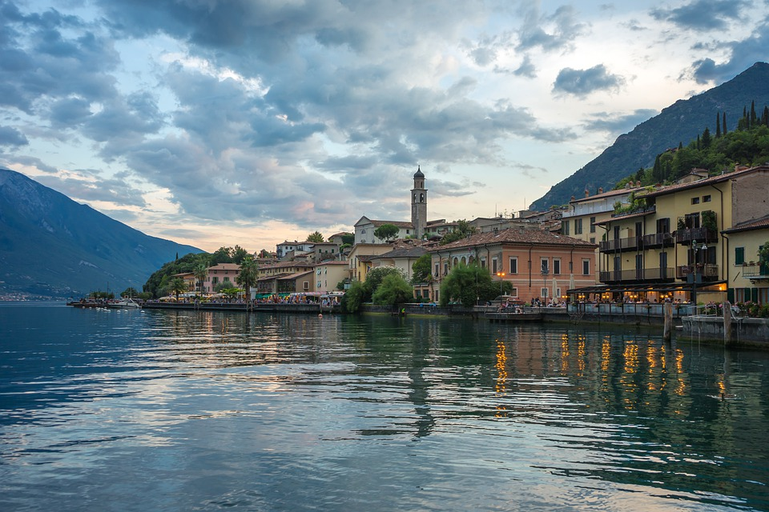
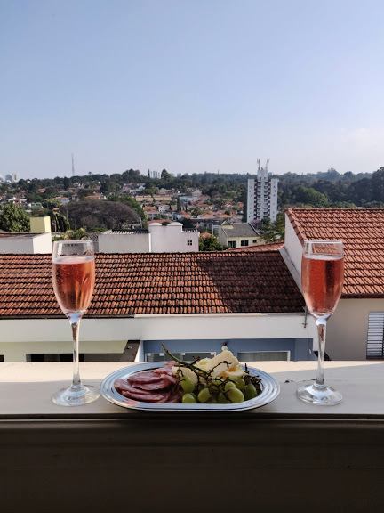

# Photomosaics
> A program that creates a photomosaics of a picture out of smaller images.

## Instructions:
1. Install the required gems.
```ruby
bundle install
```

2. Upload your source images to the `source` folder and run the `square_source_images.rb` script.
```ruby
ruby square_source_images.rb
```

3. Update configs at the beginning of `app.rb`.
- `SQUARE_SIZE`: size of each source image *(default = 10)*
- `PATH_IN`: path to input image *(default:`img/in.jpg`)*
- `PATH_OUT`: path to output image *(default: `img/out.jpg`)*
- `CACHE_PATH`: path to cache file *(default: `average_colors_cache.json`)*
    - OBS: this is used to accelerate computation

3. Run the script.
```ruby
ruby app.rb
```

## Example
### Input Image


### Output Image


## Credits
Inspired by: Robert Heaton's [Programming Projects For Advanced Beginners](https://robertheaton.com/2018/11/03/programming-project-4-photomosaics/)